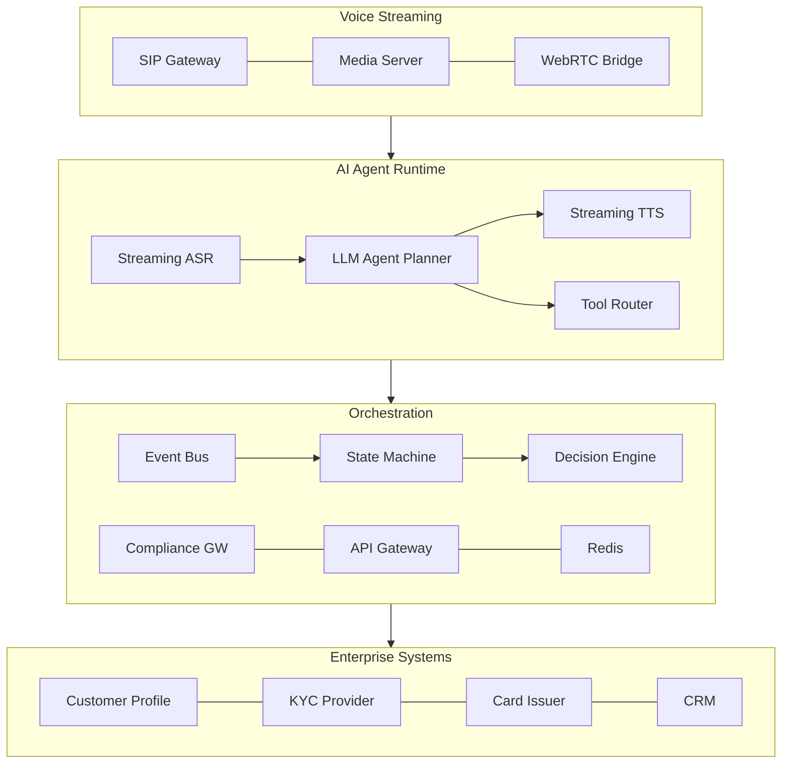

# Tiger Credit Card - AI Voice Agent

Production-grade voice AI system for credit card onboarding, from approval to activation.

Built as a reference implementation demonstrating how enterprise voice AI deployments work end-to-end: real-time voice infrastructure, LLM-powered conversational intelligence, event-driven orchestration, compliance enforcement, and a repeatable delivery model.

---

## The Problem

Tiger Credit Card approves 500K+ cards per month. 60-65% of approved customers never activate. The drop-off happens across four onboarding stages (eKYC, VKYC, activation, orientation), each requiring the customer to take a specific action. An inside sales team calls these customers manually, but at scale, human agents cannot reach everyone in time, with context, at the right moment.

## The Solution

An AI voice agent that automatically calls customers at each onboarding stage, adapts the conversation to their current status, handles objections using system data, and drives them toward activation. The agent integrates with Tiger's enterprise backend systems through an orchestration layer that enforces compliance, manages state, and prevents hallucination.

---

## Architecture



**Four layers, each with a distinct job:**

| Layer | What it does | Key components |
|-------|-------------|----------------|
| Voice Streaming | Real-time audio capture, transport, playback | SIP gateway, RTP media server, WebRTC bridge |
| AI Agent Runtime | Speech understanding, reasoning, response generation | Streaming ASR, LLM planner, tool router, streaming TTS |
| Orchestration | State management, compliance, event processing | State machine, decision engine, compliance gateway, Redis |
| Enterprise Systems | Customer data, KYC, card lifecycle, CRM | 8 backend systems (simulated with realistic API contracts) |

**Critical design constraint:** The LLM never directly accesses enterprise APIs. All system interactions go through typed tool functions validated by a policy gateway. This is the trust boundary between probabilistic AI and deterministic enterprise systems.

---

## Try It

### Prerequisites

- Docker and Docker Compose
- Python 3.11+ (for scripts)
- (Optional) Vapi.ai account for real voice calls

### Quick Start

```bash
git clone https://github.com/[your-username]/tiger-voice-agent.git
cd tiger-voice-agent

# Setup
make setup

# Start all services
make run

# Load test customers
make seed

# Check everything is running
curl http://localhost:8000/health
curl http://localhost:8001/health
```

### Test the Pipeline

```bash
# Trigger a card_approved event for test customer Priya Sharma
make trigger

# Or process it synchronously to see the full pipeline result
python scripts/trigger_event.py --event card_approved --customer TC001 --sync

# View orchestrator logs
make logs-orchestrator
```

### Make a Real Voice Call (requires Vapi.ai)

```bash
# Set your Vapi credentials in .env
cp .env.example .env
# Edit .env: add VAPI_API_KEY, VAPI_ASSISTANT_ID, VAPI_PHONE_NUMBER_ID
# Set MOCK_MODE=false

# Restart services
make restart

# Call a test number
python scripts/test_call.py --customer TC001 --phone +91XXXXXXXXXX
```

### Run Tests

```bash
make test
```

---

## How It Works

### Event-Driven Onboarding Pipeline

When a customer's onboarding stage changes (card approved, eKYC completed, VKYC completed, card activated), the source system publishes an event. The orchestrator consumes it and runs this pipeline:

1. **Dedup check** - Skip if this event was already processed (prevents duplicate calls from at-least-once delivery)
2. **Context assembly** - Fetch customer profile, credit decision, KYC status, call history from backend systems
3. **Pre-call state refresh** - Re-read the customer's current stage to prevent race conditions (customer may have advanced since the event was produced)
4. **Compliance check** - Verify consent, DND registry, call time window (9AM-9PM IST), cooldown period
5. **Decision engine** - Compute priority and timing (activation-pending customers get highest priority, exponential backoff for retries)
6. **Session creation** - Store full customer context in Redis for the duration of the call
7. **Voice interaction** - Agent calls the customer with stage-specific conversation flow

### Voice Agent Tool Calling

The agent operates through structured tool functions, not direct API access:

| Tool | What it does | Policy constraint |
|------|-------------|-------------------|
| `verify_identity` | Verify customer via phone last 4 digits | Max 3 attempts, lockout after failure |
| `get_vkyc_slots` | Fetch available VKYC time slots | Only returns 9AM-9PM slots |
| `book_vkyc_slot` | Book a VKYC appointment | Requires consent = true |
| `send_sms_link` | Send eKYC/activation deep link via SMS | Max 3 SMS per day |
| `trigger_activation` | Activate the credit card | Requires VKYC complete, irreversible |
| `log_disposition` | Log call outcome to CRM | Required at end of every call |
| `transfer_to_human` | Warm transfer to inside sales | Packages full conversation context |

Every tool call passes through schema validation, policy checking, and rate limiting before execution.

### Conversation State Machine

```
INIT -> COMPLIANCE_CHECK -> GREETING -> IDENTITY_VERIFY -> STAGE_FLOW
                                                              |
                                              +---------------+---------------+
                                              |               |               |
                                        OBJECTION_HANDLER  TOOL_EXECUTION  CONFIRMATION
                                              |               |               |
                                              +-------+-------+          WRAP_UP -> END
                                                      |
                                                  ESCALATE -> END
```

The state machine prevents invalid transitions (the agent cannot skip identity verification), tracks objection count (auto-escalates at 3+), and ensures disposition logging before call end.

---

## Key Design Decisions

**Why Redis pub/sub instead of Kafka?** For the demo, Redis provides the same event-driven semantics without requiring a Kafka cluster in Docker compose. The event consumer interface is identical; swapping to Kafka in production requires changing the transport layer, not the processing logic.

**Why mock backends instead of stubs?** The mock backends serve realistic API responses with proper HTTP status codes, configurable failure injection, and latency simulation. They ARE the integration specification. A reviewer can look at the API routes and know exactly what the real integration surface would look like.

**Why tool calling instead of direct API access?** The LLM is probabilistic. Enterprise systems are deterministic. The tool router is the trust boundary. Even if the LLM hallucinates a tool call with wrong parameters, the schema validator catches it. Even if it tries to access restricted data, the policy gateway blocks it. Defense in depth.

**Why PII masking at the gateway, not in the prompt?** Prompt instructions are suggestions. Gateway enforcement is a guarantee. The LLM never sees raw PAN or Aadhaar numbers because they are masked before entering the context window. You cannot accidentally leak what you never had.

---

## Project Structure

```
tiger-voice-agent/
  docker-compose.yml          # Redis + mock-backends + orchestrator
  Makefile                    # make run, make test, make seed, make trigger

  orchestrator/               # Core orchestration service (FastAPI)
    src/
      main.py                 # App entry, lifespan management
      config.py               # Settings from environment
      models.py               # All data contracts (Pydantic)
      state_machine.py         # Conversation state transitions
      decision_engine.py       # Next-best-action computation
      compliance_gateway.py    # PII masking, consent, call window
      event_consumer.py        # Redis pub/sub consumer
      session_store.py         # Redis session management
      dedup.py                # Idempotency cache
      routes/
        health.py             # Health + readiness checks
        events.py             # Event ingestion endpoint
        vapi_webhook.py       # Vapi tool-call webhook handler
      tool_handlers/
        handlers.py           # Business logic for all 7 tools
    tests/                    # Unit tests for core logic

  mock_backends/              # Simulated Tiger enterprise systems (FastAPI)
    src/main.py               # All 8 backend APIs in one service
    seed_data/
      customers.json          # 10 test customers at every stage
      README.md               # Explains each test persona

  agent/                      # Voice agent configuration
    prompt.md                 # Production prompt (Vapi/Retell ready)
    vapi_config.json          # Vapi assistant configuration
    tools/                    # Tool function definitions
    knowledge_base.md         # Tiger Card product facts

  docs/                       # Architecture documentation
    diagrams/                 # Mermaid diagrams

  scripts/                    # Utility scripts
    seed.py                   # Load test data
    trigger_event.py          # Simulate stage-change events
    test_call.py              # Initiate real Vapi calls
```

---

## Test Customers

| ID | Name | Stage | Scenario |
|----|------|-------|----------|
| TC001 | Priya Sharma | EKYC_PENDING | Fresh approval, happy path |
| TC002 | Rahul Mehta | EKYC_PENDING | Hindi speaker, one prior no-answer |
| TC004 | Vikram Patel | VKYC_PENDING | Failed VKYC once, two prior calls |
| TC005 | Deepika Nair | ACTIVATION_PENDING | All KYC done, first activation call |
| TC006 | Arjun Reddy | ACTIVATION_PENDING | Low limit, not revision-eligible, 2 calls |
| TC007 | Kavya Krishnan | CARD_ACTIVE | Fully activated, orientation pending |
| TC008 | Ravi Kumar | EKYC_PENDING | **Consent NOT given** (call blocked) |

---

## Documentation

Detailed architecture documentation is in [`/docs`](./docs/):

- [System Architecture](docs/01-architecture.md)
- [AI Agent Runtime](docs/02-agent-runtime.md)
- [Voice Infrastructure](docs/03-voice-infrastructure.md)
- [Event System](docs/04-event-system.md)
- [Compliance and Security](docs/05-compliance-security.md)
- [Enterprise Delivery Playbook](docs/06-delivery-playbook.md)
- [Observability](docs/07-observability.md)
- [Prompt Design](docs/08-prompt-design.md)

---

## What's Real vs What's Simulated

| Component | Status | Notes |
|-----------|--------|-------|
| Voice agent prompt | Real | Production-ready, deployed in Vapi |
| Tool function definitions | Real | Vapi-format, wired to webhook |
| Orchestrator service | Real | FastAPI, handles webhooks and events |
| State machine | Real | Full test coverage |
| Compliance gateway | Real | PII masking, consent, call window |
| Idempotency/dedup | Real | Redis-backed |
| Event consumer | Real | Redis pub/sub (Kafka in production) |
| Redis | Real | Runs in Docker |
| Enterprise backends | Simulated | Realistic API contracts + failure injection |
| Telephony/SIP | Vapi-managed | Vapi handles call infrastructure |
| Monitoring stack | Documented | Architecture in docs, not running |

---

## License

MIT
