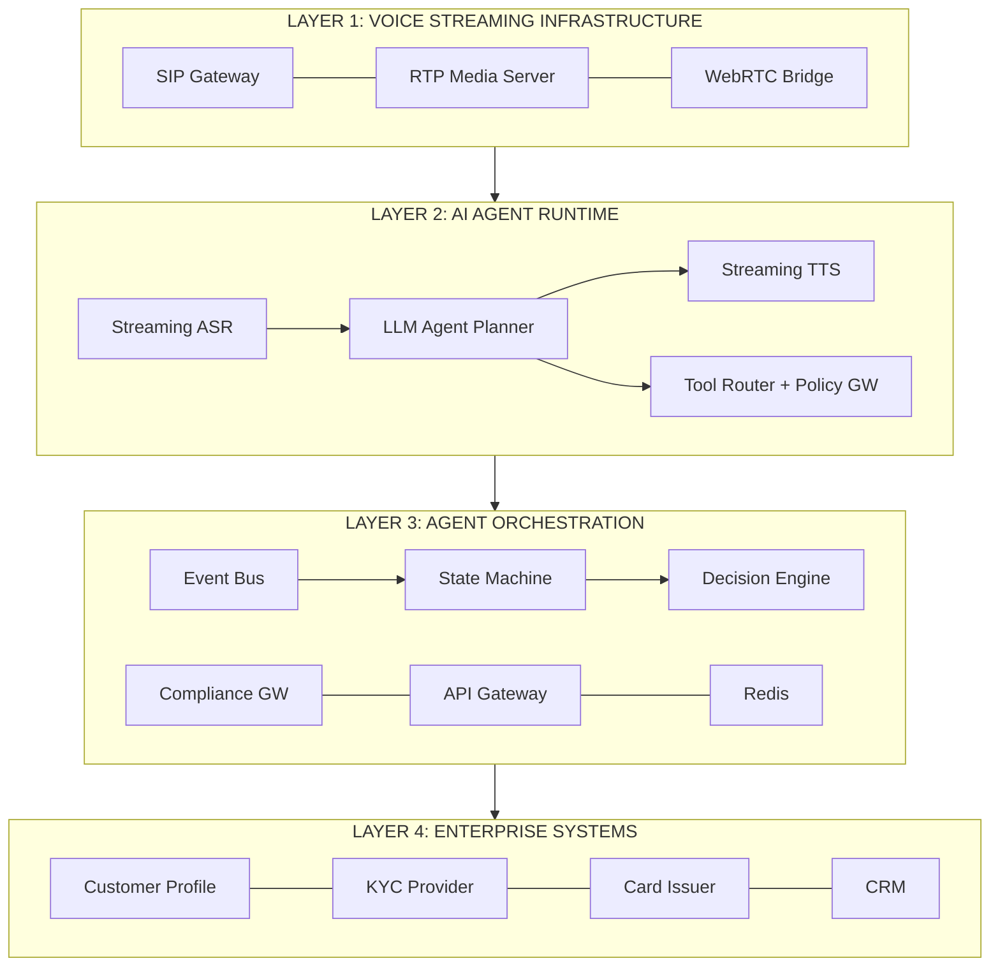

# System Architecture

## Overview

The Tiger Voice Agent architecture is organized into four horizontal layers. Each layer has a distinct operational boundary, failure domain, and scaling characteristic. This separation enables independent deployment, fault isolation, and horizontal scaling of each concern.

## Layer 1: Voice Streaming Infrastructure

The real-time media layer. Handles audio capture, codec processing, network transport, and playback. Components: SIP gateway for call signaling (INVITE, BYE, REFER for transfers), RTP media server for bidirectional audio streaming, WebRTC bridge for in-app voice interactions, and DTMF decoder for touchtone input during IVR fallback.

The media server runs on dedicated instances with kernel-level audio processing. Audio processing cannot share CPU with garbage-collected workloads. In production, this layer runs on bare-metal or dedicated VM instances, never on shared Kubernetes pods.

## Layer 2: AI Agent Runtime

The intelligence layer where speech becomes understanding and understanding becomes action. Five sub-components operate as a streaming pipeline: streaming ASR (Deepgram or Whisper-based) producing partial transcripts in real time, intent detector and slot filler classifying utterances against conversation state, LLM-based agent planner determining the next action given conversation history and available tools, tool router executing system operations through a policy-controlled gateway, and streaming TTS (ElevenLabs or Azure Neural TTS) beginning to speak before the full response is generated.

**Critical constraint:** The LLM never directly accesses enterprise systems. All interactions are mediated through typed tool functions exposed by the orchestration layer.

## Layer 3: Agent Orchestration

The control plane governing what the AI agent is allowed to do and what data it can see. Includes: conversation state machine tracking progress through onboarding stages, decision engine computing next-best-action based on customer context, compliance gateway enforcing PII masking and consent verification before any data is exposed, API gateway mediating all reads and writes to enterprise systems, Redis-backed session store for sub-millisecond context lookups, and event consumers listening to the event bus for stage-change triggers.

The orchestration layer is the trust boundary between the AI (probabilistic) and enterprise systems (deterministic).

## Layer 4: Enterprise Systems

Tiger's existing backend infrastructure. The voice agent treats these as external services accessed through well-defined API contracts. See the [mock backends](../mock_backends/src/main.py) for the complete API surface.

| System | Role | Key Data |
|--------|------|----------|
| Customer Profile (CPS) | Golden record for identity and state | Name, phone, stage, PAN (masked), Aadhaar (masked) |
| Credit Decision (CDE) | Underwriting decisions and limits | Credit limit, risk tier, revision eligibility |
| KYC Provider | eKYC and VKYC orchestration | KYC status, VKYC slots, attempt count, failure reasons |
| Card Issuer (CIS) | Card lifecycle management | Virtual/physical card status, activation, welcome rewards |
| CRM / Sales | Customer engagement tracking | Call history, dispositions, campaign source, lead score |
| Notification System | Multi-channel messaging | Push, SMS, WhatsApp, deep link generation |
| Compliance Engine | Regulatory guardrails and audit | Consent, DND, call time window, audit log |
| Telephony Platform | Voice call infrastructure | SIP trunking, call recording, transfer routing |

## Inter-Layer Communication

Each layer communicates only with the layer directly above and below it:

- Layer 1 streams audio to Layer 2
- Layer 2 issues tool calls to Layer 3
- Layer 3 translates tool calls into API requests against Layer 4
- Data never flows from Layer 4 directly to Layer 2 without passing through Layer 3's compliance gateway

This constraint is non-negotiable in financial services deployments.

## Diagram Files

Full architecture diagrams are in [`docs/diagrams/`](./diagrams/):

- [architecture.mermaid](./diagrams/architecture.mermaid) - Complete 4-layer system topology
- [agent-runtime-pipeline.mermaid](./diagrams/agent-runtime-pipeline.mermaid) - Single-turn processing sequence
- [sequence-flow.mermaid](./diagrams/sequence-flow.mermaid) - Event-driven onboarding flow
- [state-machine.mermaid](./diagrams/state-machine.mermaid) - Conversation state machine
- [delivery-timeline.mermaid](./diagrams/delivery-timeline.mermaid) - 12-week deployment Gantt
