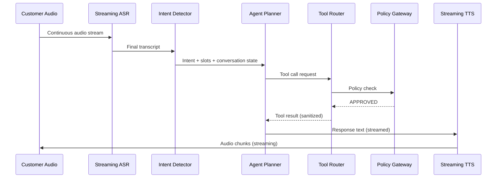

# AI Agent Runtime

## Runtime Pipeline

The agent runtime transforms customer speech into understanding, decision, action, and response through a six-stage streaming pipeline. Each stage is independently observable, measurable, and replaceable.

| Stage | Component | Input | Output | Latency Target |
|-------|-----------|-------|--------|---------------|
| 1 | Streaming ASR | Audio byte stream | Partial + final transcripts | 100-300ms partials |
| 2 | Intent Detection | Transcript + history | Intent + confidence + slots | <50ms |
| 3 | Agent Planner | Intent, slots, context, tools | Next action: respond / tool_call / escalate | 200-600ms (LLM) |
| 4 | Tool Router | Tool call request | Execution result (structured) | 50-200ms (API) |
| 5 | Response Generator | Action result + context | Natural language response (streamed) | 200-500ms (first token) |
| 6 | Streaming TTS | Response text stream | Audio byte stream | 150-300ms (first chunk) |

## The Agent Planner

The LLM-powered core. It receives a structured context window containing: conversation history, customer profile and stage (injected by orchestration layer), available tools with descriptions and constraints, state machine's current state, and compliance constraints.

Given this context, the planner decides one of three actions:
- **Generate a response** (most common)
- **Execute a tool call** (fetch VKYC slots, send SMS, book a slot)
- **Escalate to human** (when agent limits are reached)

## Tool Router and Policy Gateway

When the agent planner decides to call a tool, the request passes through three validation stages:

1. **Schema Validation:** Tool call must match the declared function signature. Malformed requests are rejected and the planner retries.

2. **Policy Check:** The compliance gateway evaluates whether this call is permitted. Examples of blocked requests: reading a full PAN number, booking a VKYC slot outside 9AM-9PM, making a second outbound call within the cooldown period.

3. **Rate Limiting:** Each tool has a per-session call limit. If the agent attempts the same tool >3 times in a single turn (confused reasoning), the session is flagged and escalated.

Only after all three checks pass does the tool router execute the API call. The result is sanitized (PII masked) before returning to the planner.

See [`orchestrator/src/tool_handlers/handlers.py`](../orchestrator/src/tool_handlers/handlers.py) for the implementation.

## Hallucination Control

Four mechanisms prevent the agent from stating false information:

**Grounded Generation:** The prompt instructs the model to only state facts present in injected system variables. Claims not grounded in provided data trigger a self-check and tool call.

**Constrained Output:** For critical fields (credit limit, fee amounts, reward values), templated strings with variable injection are used. The model decides WHEN to mention the credit limit, but the actual number comes from `{{credit_limit}}`, not from generation.

**Output Validation:** A post-generation validator checks for: numbers not matching injected variables, unsupported promises, and product features not in the knowledge base. See `compliance_gateway.validate_agent_response()`.

**Conversation Audit:** Every agent turn is logged with the full context window and generated response. Offline analysis compares statements against ground truth to compute hallucination rate. Target: <0.5%.
