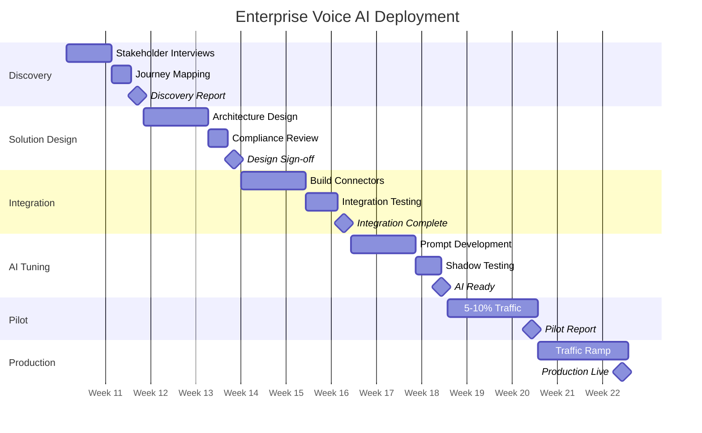

# Enterprise Delivery Playbook

## Overview

This playbook describes how AhinsaAi deploys voice AI for enterprise customers as a repeatable, predictable process. The model targets 8-12 week deployments with defined deliverables and quality gates at each phase.

The goal is a delivery machine, not a consulting practice: every deployment should be faster than the last because each one feeds reusable patterns back into the platform.

## Phase 1: Discovery (Weeks 1-2)

### Activities
- Stakeholder interviews: product owner, engineering lead, compliance officer, operations head, inside sales team lead
- Current-state journey mapping: document the onboarding funnel with conversion rates at each stage, time-in-stage distributions, and drop-off reasons
- Technology landscape assessment: catalog existing systems with API capabilities, SLAs, and known limitations
- Compliance requirements gathering: applicable regulations, consent mechanisms, data residency, audit obligations
- Voice AI readiness assessment: telephony infrastructure, phone number inventory, call recording, existing IVR

### Deliverables
- Discovery Report: current-state analysis with quantified opportunity
- Integration Architecture Proposal: preliminary system interaction design
- Risk Register: technical, regulatory, and operational risks
- Project Charter: scope, timeline, team, success criteria, go/no-go for pilot

### Quality Gate
All stakeholder interviews done, funnel quantified with actual data, all required APIs documented, project charter signed off.

## Phase 2: Solution Design (Weeks 2-4)

### Activities
- System architecture design: finalize the four-layer architecture for the customer's tech stack
- Event schema design: define event contracts with the customer's engineering team
- Conversation flow design: map each stage to a flow including objection handling. Review with inside sales team.
- Compliance review: customer's legal/compliance team reviews flows, disclosure language, data access patterns
- Integration specification: API contracts for each system, including auth, rate limits, error handling, SLAs

### Deliverables
- Technical Architecture Document
- Conversation Design Spec: flows, objection matrix, escalation logic
- Integration Specification: API contracts for every touchpoint
- Compliance Sign-off

### Quality Gate
Architecture approved by customer's engineering team, flows approved by business and compliance, integration specs agreed with API owners.

## Phase 3: Integration (Weeks 4-6)

### Activities
- Build integration connectors for each enterprise system
- Event pipeline setup: topics, schema registry, consumer groups, dead letter queues
- Orchestration layer deployment: state machine, decision engine, compliance gateway, API gateway
- Telephony configuration: SIP trunks, phone numbers, call recording, transfer routing
- Integration testing: end-to-end test of each stage flow with mock data

### Deliverables
- Working integration environment with all connectors deployed and tested
- Integration test report: pass/fail per flow, defect list, remediation plan
- Monitoring dashboards: system health, API latency, error rates, event queue depth

### Quality Gate
All integrations pass automated suites, end-to-end flows complete without manual intervention, monitoring dashboards green, event pipeline within SLA.

## Phase 4: AI Behaviour Tuning (Weeks 6-8)

### Activities
- Prompt development from conversation design spec
- Voice persona tuning: TTS voice selection, accent, pace, naturalness testing with native speakers
- Objection scenario testing: all predefined scenarios verified for accuracy, empathy, compliance
- Edge case testing: system failures, missing data, adversarial inputs
- Latency optimization: end-to-end pipeline targeting <800ms p95
- Inside sales shadow testing: best agents rate AI calls for quality and naturalness

### Deliverables
- Production-ready prompt (version-controlled, compliance-approved)
- AI quality report: resolution rate, hallucination rate, latency, shadow test scores
- Tuning log: all iterations with rationale and results

### Quality Gate
All objection scenarios handled correctly, hallucination rate <0.5%, p95 latency <800ms, shadow testers rate >80% as acceptable, compliance team approves final prompt.

## Phase 5: Pilot Deployment (Weeks 8-10)

### Activities
- Deploy to production at 5-10% of new approvals
- War room monitoring for first 48 hours
- Daily review: analyze all conversations, classify outcomes, iterate on prompt
- A/B comparison against human inside sales team
- Escalation monitoring: rate, reasons, transfer success

### Deliverables
- Pilot performance report: conversion rates, human baseline comparison, CSAT, escalation analysis
- Issue log with resolutions
- Go/No-Go recommendation with supporting data

### Quality Gate
AI conversion rate >= 80% of human baseline, zero compliance incidents, escalation rate <15%, CSAT >3.5/5, reliability >99.5%.

## Phase 6: Production Rollout (Weeks 10-12)

### Activities
- Gradual traffic ramp: 25%, 50%, 75%, 100% over 2 weeks
- Human agent redeployment: handle AI escalations, work DLQ/hard-to-reach customers, provide prompt feedback
- Operational handover: daily monitoring transition, documented runbooks
- Knowledge transfer: prompt management, monitoring, escalation handling

### Deliverables
- Production system at 100% traffic
- Operations runbook: monitoring, alerting, incident response, prompt updates
- Knowledge transfer documentation and training sessions
- Ongoing support agreement with SLA and monthly review cadence

### Quality Gate
100% traffic handled, customer ops team can manage independently, support SLA agreed, first monthly review scheduled.

## Delivery Pattern Reusability

Each deployment feeds reusable patterns into the platform:

- **Integration connectors:** API clients for common systems (Salesforce, various KYC providers) are packaged as modules. Second customer using the same CRM takes 30% less time.
- **Conversation patterns:** Objection handling for common financial scenarios (fee justification, limit concerns, competitor comparison) is templatized.
- **Compliance templates:** RBI/TRAI compliance configs are packaged as a reusable module for any Indian financial services deployment.
- **Quality benchmarks:** Each deployment's results establish benchmarks for future predictions.
